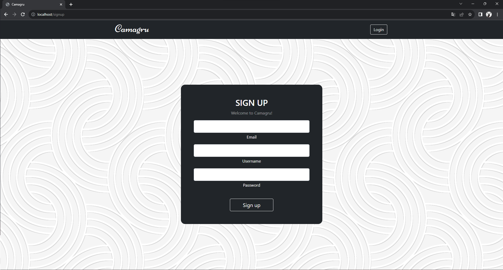
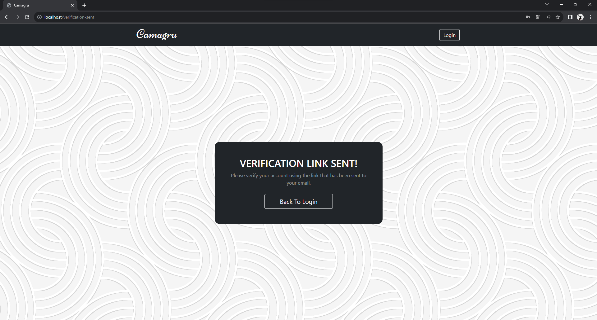

# 42-camagru

This project is about making a website for posting images with stickers.

## Images & Gifs




## Usage

First run `npm i` to install the dependencies (only dependency is Babel).

After that run `make` to transpile the javascript code.

Lastly run `make run` to dokcer-compose up the entire project.

**Important Note:** You need to create a `.env` file at the `tools/` folder. Inside of it paste this:

```
MYSQL_DB="camagru"
MYSQL_ROOT_PASS="123"
DATABASE_HOST="db"
SENDGRID_API_KEY=""
```

In order to properly use the project you need to write your own sendgrid api key to the `SENDGRID_API_KEY=""` section. This is essential for email verification and notificiations.
